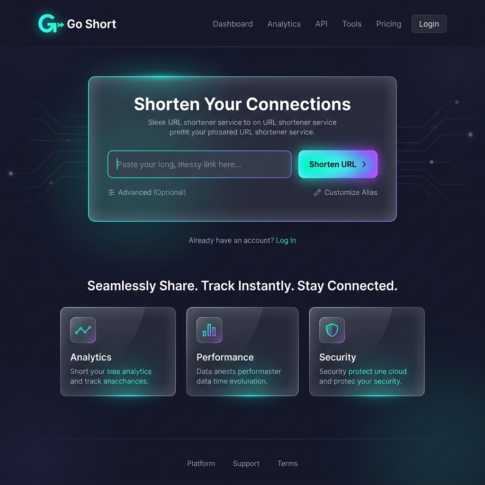
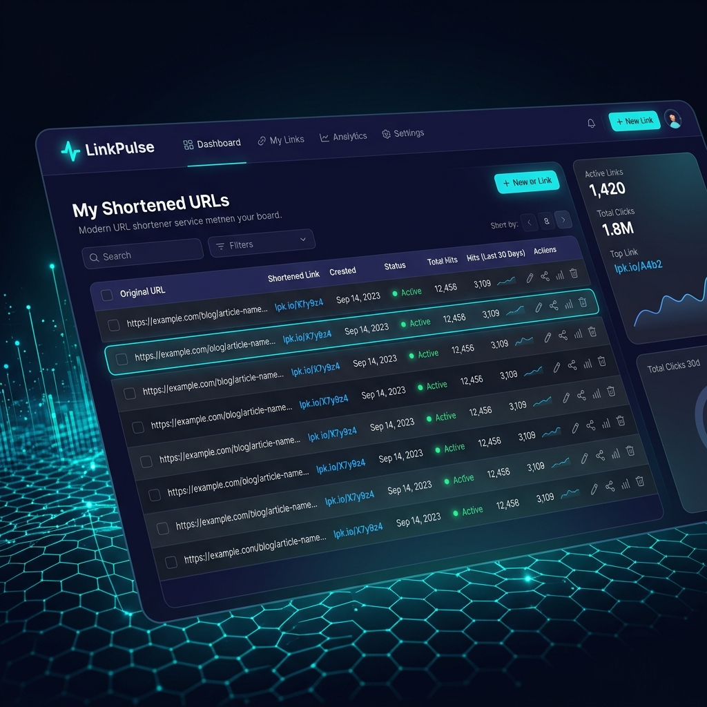

<!-- SPDX-FileCopyrightText: 2023-2026 Sayantan Santra <sayantan.santra689@gmail.com> -->
<!-- SPDX-License-Identifier: MIT -->

#  Go Short

**Go Short** 是一个极简、极速、无广告、且拥有现代感交互设计的自托管 URL 短链接缩短服务。它基于 Rust 开发，后端使用 Actix Web，前端使用原生的 HTML5 / CSS3 / Vanilla JS 编写，在提供出色的高并发、低延迟性能的同时，完全去除了不必要的追踪与臃肿功能。

> 💡 **设计宗旨**：快速、现代、小巧、安全。

---

## 🎨 界面预览 / Preview

### 📍 极简美观的落地页
页面采用了深色极简风格，配合精美的网格背景、平滑的渐变色按钮以及顺畅的交互动画，带来极致的用户体验。


### 📊 现代化管理后台
管理后台提供短链接生成、链接列表、总点击量（Hits）实时统计、一键复制、生成 QR 码及过期时间配置等功能。


---

## ✨ 核心特性 / Features

- ⚡ **极致轻量**：Docker 镜像仅为约 10MB (Alpine)，日常运行内存占用极小 (< 15MB)。
- 🚀 **超高性能**：基于 Rust 高性能 Web 框架 [Actix Web](https://actix.rs/) 编写，秒级并发响应。
- 🛡️ **安全与隐私**：
  - 纯粹的点击量统计，不收集、不追踪用户的任何隐私信息。
  - 支持会话认证及自定义 API 密钥，保障后台管理安全。
- 🕒 **过期机制**：生成链接时支持设置过期延迟，到期自动清理或失效。
- 📱 **响应式布局**：完美适配桌面端、平板端以及移动端，原生支持跟随系统的暗黑模式。
- 🔗 **支持自定义后缀**：用户可以为短链接指定个性化的路径后缀。
- 📦 **开箱即用**：提供 Docker Compose 配置文件，简单一键即可拉起完整服务。

---

## ⚙️ 快速开始 / Quick Start

### 1. 使用 Docker Compose 部署

在项目根目录下，直接使用 `docker-compose` 启动服务：

```bash
docker-compose up -d --build
```

服务自动在 `25504` 端口（或你在 `docker-compose.yml` 中映射的端口）拉起。

### 2. Nginx 反向代理配置

建议使用 Nginx 对短网址服务进行反向代理，并配置 SSL。这里是推荐的 Nginx 配置文件片段：

```nginx
server {
    listen 80;
    listen 443 ssl http2;
    server_name go.yourdomain.com;

    # SSL 证书配置略...

    # 防止静态资源请求被短链接服务劫持
    location = /style.css {
      proxy_pass http://127.0.0.1:25504/style.css;
    }

    # 管理后台
    location = /dashboard {
      proxy_set_header X-Forwarded-For $proxy_add_x_forwarded_for;
      proxy_set_header X-Real-IP $remote_addr;
      proxy_redirect off;
      proxy_pass http://127.0.0.1:25504/dashboard.html;
      proxy_buffering off;
    }

    # 默认反向代理短网址及 API
    location / {
      proxy_set_header X-Forwarded-For $proxy_add_x_forwarded_for;
      proxy_set_header X-Real-IP $remote_addr;
      proxy_redirect off;
      proxy_pass http://127.0.0.1:25504;
      proxy_buffering off;
    }
}
```

---

## 🛠️ 技术栈 / Technology Stack

- **Backend**: Rust 1.96+, Actix Web, Sqlite (rusqlite)
- **Frontend**: HTML5, Vanilla CSS, Vanilla JS
- **Design Elements**: Outfit (Google Fonts), Subtle grid design, Custom Glassmorphism UI
- **Redirection**: Temporary (302) or Permanent (301) configurable redirects

---

## 📄 开源协议 / License

本项目基于 **MIT License** 许可协议开源。
